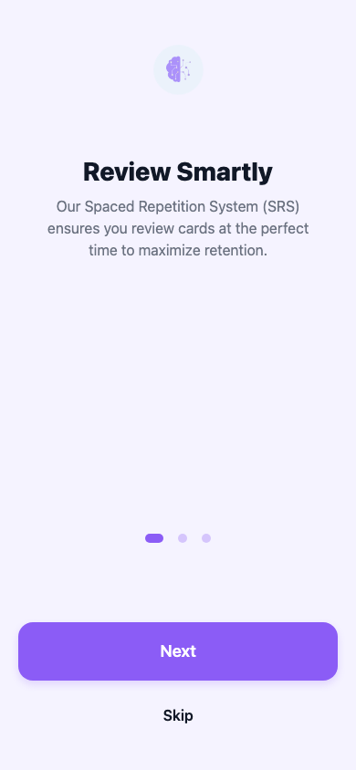
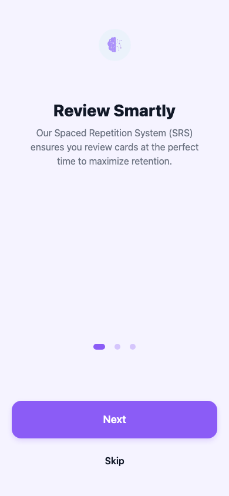
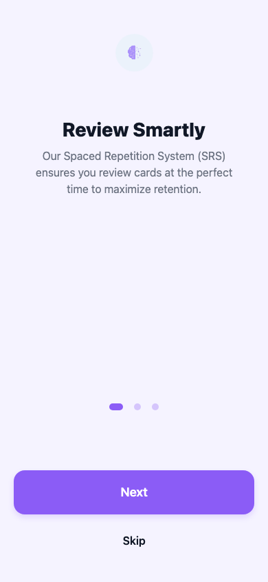
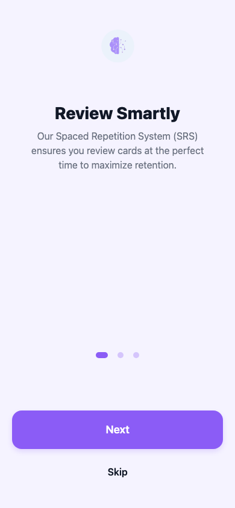

# Flashcardia User Testing Guide 🚀

Welcome to the **Flashcardia** beta test! Thank you for helping us improve the app. This guide will walk you through the core features of the app and how to test them.

## 📥 1. Installation

Since the app is currently in beta, you will need to install it directly using the provided APK file.

1. Download the `Flashcardia.apk` file provided by the developer.
2. Open the file on your Android device.
3. If prompted, allow your browser or file manager to **"Install unknown apps"**.
4. Tap **Install** and open the app!

---

## 👤 2. Getting Started & Profile

When you first open Flashcardia, you will be greeted by the **Sign In** screen. This is where you can securely access your account to sync your study data across devices.

### Create Account

If this is your first time, you must create a new account:

1. Tap on **"Sign Up"** or **"Create Account"**.
2. Enter a valid **Email address** and **Password** (min 6 characters).
3. Tap **Sign Up**. You might be asked to verify your email.

### Sign In

Already have an account?

1. Enter your registered email and password on the **Sign In** screen.
2. Tap **Sign In**.
3. (Optional) You can also pick **"Continue as Guest"** to test the app without internet sync.

> 

### Change Language

Magic Deck AI supports multiple languages (English and Spanish).

1. Go to the **Settings** tab (bottom right of the navigation bar).
2. Tap on **Language**.
3. Select your preferred language. The app will immediately translate all text to the newly selected language.

### Home Screen Overview

- **Header**: At the top right, you'll see your Avatar and your Current Streak (🔥).
- **Dashboard**: Two main cards show you how many cards are **Due Today** and how many words you have fully **Learned**.
- **Your Decks**: Below the dashboard, you'll see a list of your study decks.

> 

---

## 🗂️ 3. Creating Your First Deck

Decks are folders where you keep your flashcards (e.g., "Spanish Vocab", "React Native Interview Questions").

1. On the Home Screen, tap the big purple **`+` (Plus)** button in the bottom right corner.
2. A bottom sheet will slide up. Type a name for your new deck (e.g., "My First Deck").
3. Tap **Create Deck**.
4. Your new deck will instantly appear in the "Your Decks" list!

> 

---

## ✨ 4. Generating Cards with AI & Voice

This is where the magic happens! Flashcardia uses AI to automatically generate the definition, phonetic spelling, and usage examples for any word or concept you want to learn.

1. Tap on the deck you just created to open the **Deck Detail Screen**.
2. Tap the **✨ Create Card with AI** button.
3. **Voice Input**: Tap the **Microphone (🎤)** icon.
   - *(Note: You will need to grant Microphone permissions the first time you do this.)*
   - Speak the word you want to learn!
4. Alternatively, you can just type the word.
5. Tap **Generate**.
6. Wait a few seconds while the AI builds a comprehensive flashcard for you.
7. Review the generated card, which includes the definition, meaning, and examples.
8. Tap **Save** to add it to your deck!

> 

---

## 🧠 5. Studying Your Cards (The SRS System)

Flashcardia uses Spaced Repetition (SRS) to ensure you remember what you learn. The app will automatically schedule cards for review just as you're about to forget them.

1. On the Home Screen, you'll notice color-coded badges next to your decks:
   - 🔵 **Blue**: New Cards
   - 🔴 **Red**: Learning (Cards you are currently struggling with)
   - 🟢 **Green**: Mastered/Review (Cards you know well)
2. Tap a deck and press the large **▶️ Start Session** button.
3. The flashcard will appear. Try to remember the meaning!
4. Tap the card to flip it and see the answer.
5. Grade yourself honestly using the buttons at the bottom:
   - **Again**: You didn't know it. (The card will stay in the "Learning" loop).
   - **Hard**: You struggled, but remembered it.
   - **Good**: You knew it correctly.
   - **Easy**: It was too easy! (The card will be pushed far into the future).
6. Continue until all due cards for the day are clear!

> 

---

## 🏆 6. Challenge Mode (Test Your Knowledge)

The **Challenge** tab puts your memory to the test! Instead of just reviewing flashcards, you'll be prompted to write sentences using the words you've learned. The AI will evaluate your creativity and grammar.

1. Navigate to the **Challenge** tab.
2. Select the deck you want to be tested on.
3. Choose your **Difficulty Mode**:
   - 🟢 **Easy Mode**: Just finish all the cards. There are no score requirements. This mode is great for simple practice without pressure.
   - 🔴 **Hard Mode**: You must achieve a score of **> 5.5** on each card. The AI grades your sentences strictly. If you fail to write a high-quality sentence, you must try again!
4. Tap **Start Challenge** and type your best sentences.

> 
> 

---

## 🔥 7. Streaks & Gamification

Consistency is key to learning!

- Complete at least one review session to extend your daily streak.
- If you have an active session, a celebration modal will appear praising your hard work!
- Watch your 🔥 streak counter grow every day.

---

## 🐛 7. How to Report Bugs

As a beta tester, your feedback is incredibly valuable. If you encounter any crashes, weird visual glitches, or things that don't make sense:

1. Try to take a screenshot or screen recording of the bug.
2. Note what you were doing right before it happened.
3. Send the details directly to the developer!

**Happy Testing!** 🎉
